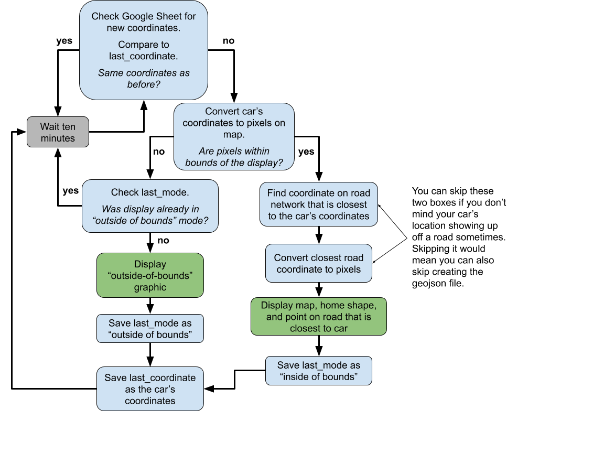

# ePaper Parking Display
A display that shows your car's parked location. Automatically updated by a Tasker script.

## Video of Display in Action
Here is a gif of how the display looks when it is refreshed. I've shortened the video substantially, the actual refresh takes a minutes and forty-four seconds.

## How does it work?
Your location is stored in a Google Sheet. The idea is for this coordinate value to be automatically updated. 

I used Tasker to automatically update the location with my phone when it disconnected from bluetooth. iOS devices can also automate this update process using the app Shortcuts, although they have to manually trigger the process until Apple allows tasks to be triggered by disconnecting from bluetooth.

## How can I set this up?
This project is definitely a work in progress and not "plug-and-play". In this, the second version, I believe it's possible for you to follow the installation instructions below and create your own version. I haven't smoothed out all of the bugs yet, however. [Please read up on the first version of the project here](https://www.emilyboda.com/post/parking-display) and if you do end up replicating it, please contact me there and let me know the issues you ran into.

## Full Installation Instructions
### You will need:
- [Raspberry Pi Zero](https://www.amazon.com/gp/product/B0748MPQT4/ref=as_li_ss_tl?ie=UTF8&psc=1&linkCode=ll1&tag=nova08-20&linkId=fdde8192b5aa90f4fe858929bb859e76&language=en_US)
- [7.5" ePaper Screen](https://www.amazon.com/waveshare-7-5inch-HAT-Raspberry-Consumption/dp/B075R4QY3L/ref=as_li_ss_tl?dchild=1&keywords=waveshare+7.5&qid=1600103451&sr=8-1&linkCode=ll1&tag=nova08-20&linkId=999ec0a6b15e20a99789c3f37ad49e07&language=en_US)
- A way of getting the location of your car (I used my Android smartphone, but you can use an iPhone and an NFC tag)

### Setting up the Pi
1. [Download the latest Raspberry Pi Imager](https://www.raspberrypi.org/downloads/) and flash to an SD card.
   - Use Raspbian Buster with Desktop
2. Download the [wpa_supplicant.conf](wpa_supplicant.conf) file and save it to the boot directory.
   - Edit the "ssid" and the "psk" to be your wifi name and password
   - Edit the "country" to the two-digit ISO code for your country if necessary
3. Add a blank file named "ssh" (no file extension) to the boot directory to enable SSH.
4. Eject your SD card from your computer and insert it into your Pi. Plug the Pi in to power.
5. Use an app such as [Fing](https://www.fing.com/) to scan your wifi network and identify the IP address of your new Pi.
6. Connect to the Pi using SSH.
   - [More info can be found here](https://www.raspberrypi.org/documentation/remote-access/README.md). 
   - Don't forget to change your password using the `passwd` command.
7. Expand the file system using `sudo raspi-config --expand-rootfs`.
8. Enable SPI using `sudo sed -i s/#dtparam=spi=on/dtparam=spi=on/ /boot/config.txt`.
9. Reboot Pi with `sudo reboot -h` to apply the changes.
10. Update and upgrade the Pi using `sudo apt update` and then `sudo apt full-upgrade`.

### Copy files and install required packages
11. Copy the files from the "parking" directory in this repo into the home directory Pi. Your "home" directory will usually be /home/pi/. If you choose to put the files elsewhere, you will need to change the `home directory` value in `settings.json`.
11. Download all the required files with `git clone https://github.com/emilyboda/ePaper-Parking-Display.git`
12. Install required packages using the following commands:
    - `pip3 install pyowm`
    - `pip3 install Pillow==6.2.2`

### Set up required dependencies for project
13. Set up Google Sheets
    1.  [Follow the quick start instructions](https://developers.google.com/sheets/api/quickstart/python) on a desktop computer.
    2.  Install the required packages on your Pi using `pip3 install --upgrade google-api-python-client google-auth-httplib2 google-auth-oauthlib`
    3. Use [SCP](https://www.raspberrypi.org/documentation/remote-access/ssh/scp.md) to copy the token from your desktop computer to the parking directory on your Pi. Name the credentials `token.pickle`.
    4. Open [my Google Sheet](https://docs.google.com/spreadsheets/d/1DgtmaaFHhjRTH1HdO4kMLIx5fvg1-YNFMyjy3Jc96yk/edit?usp=sharing) and "Make a Copy". This will be the Google Sheet that will house your coordinates. 
        - Every time your car is parked and new coordinates are sent, a row will be appended to the "history" tab. 
        - The "current" tab has a formula that will find the most recent coordinate and show that one.
        - When `update_parking.py` runs, it will pull the value from B2 of the "current" tab, which should be the most recent coordinates of where your car was parked.
    5. In `settings.json`, set `sheet_id` to be the sheet id, which can be found in the URL of the sheet.
        - Make sure you're using the sheet_id of *your copy* of the sheet, not mine.
14. Get the driver for your display.

    *If you bought the display I recommended, you can use the drivers contained in this github. You can skip to the next step.*

    1. If you bought a different display, download your display's driver from [here](https://github.com/waveshare/e-Paper/tree/master/RaspberryPi_JetsonNano/python/lib/waveshare_epd).
    2. Copy the file into your parking directory.
    3. In the driver file, change the second line that says `from . import epdconfig` to be `import epdconfig`.
    4. In `update_parking.py`, change `epd_7_in_5_v3_colour` in the first line to be the name of your driver file (without the .py).
    5. Note the resolution listed under `# Display resolution` in the driver. We will use this later.
15. Get the map image
    1. Create an account with [Mapbox](https://www.mapbox.com/)
    2. Get an API key ([This article will explain how it works](https://docs.mapbox.com/help/getting-started/access-tokens/)).
    3. Create an image with the [Mapbox Static Image Playground](https://docs.mapbox.com/playground/static/)
        - Your access token will be auto-filled
        - Check the box that says "Use my own public style" and either make your own or use mine
            - My custom style is: mapbox://styles/emilyboda1/cke4mk06w0smq19s6ak8ghhdz
            - If you want to make your own, you will need to make a Style in [Mapbox Studio](https://studio.mapbox.com/) and then publish it publically.
        - The width and height will be the width and height of your display in pixels. The v3 display is 528x880 pixels.
        - Play around with the longitude, latitude, and zoom to encompass your parking area. My zoom was 16.
        - The preview box shows exactly what your image will look like.
    4. Copy the Request URL directly into `settings.json` under `mapbox request url`.
        - Make sure that `update mapbox image?` is set to "yes". This will tell the script it needs to download a new image, which is very important the first time. If you ever move or decide to update the image, you can set `update mapbox image?` to "yes" to force it to refresh.
    5. Don't forget to add your home coordinates to `house coords` in `settings.json`. This should be notated in the (lat, lon) format.
16. Get your Google Maps Snap to Road API key
    1. Create an API key following the instructions [on this page](https://developers.google.com/maps/documentation/roads/get-api-key)
    2. Once you've created the API key, make sure that you select "Library" from the sidebar and search for "Roads API" and enable it.
    3. Copy your API key to `settings.json` as `google maps api key`.
17. Test your parking display!
    1. Run your file with `python3 /home/pi/ePaper-Parking-Display/parking/update_parking.py` (or change the file path to where your `update_parking.py` file is located).
    2. Take a look for any error messages!
       - If you get `ModuleNotFoundError: No module named 'pytz'`, then run `pip3 install pytz`.
18. If all goes according to plan in the previous step, then add `update_parking.py` to the crontab file.
    1. Use `crontab -e` to edit the file.
    2. Add `*/10 * * * python3 /home/pi/ePaper-Parking-Display/parking/update_parking.py` to the bottom of the file. Again, the file path should match where your `update_parking.py` file is located.
    
    *This will run the program to check for a new parking location every 10 minutes. The screen will only update if your car has actually moved to a new location on the screen.*

### Create your Tasker plugin to populate the location
*Skip to the next section if you don't have an Android device.*

19. Create a task that runs the following:
    - Get Location v2.
    - Use the Spreadsheet Update plug-in to write %gl_coordinates to cell B2 on the tab called "current".
    - I also update a second tab in the sheet to make a log with the date/time and the coordinates so I can go back and troubleshoot if necessary.
20. Create a profile to trigger the task
    - Profile should be triggered when BT is connected. Set the BT to your car's BT.
    - Connect the get location task you just created.
    - Move the task to "Exit" so it only runs when bluetooth is disconnected.

### Create a iOS Shortcuts task to populate the location
*Skip to the previous section if you don't have an iOS device*

21. [Follow these instructions](https://gist.github.com/supermamon/5080a599f3719541cb48b3c3ab4e1502) from @supermamon to set up a shortcut to update your location.
    1. Edit the shortcut so that it will upload the date, time, timestamp, and current location.
    2. At this time, "disconnect from Bluetooth" is not an available trigger on Shortcuts. You will need to either use an NFC tag in your car to trigger the shortcut, or add the task as an icon on your homescreen and manually trigger it. 

## Documentation about the code
### Documentation about zoom:
[This page from OpenStreetMaps](https://wiki.openstreetmap.org/wiki/Slippy_map_tilenames#Resolution_and_Scale) teaches you the formula to use to convert from the latitude and zoom level to the resolution (meters/pixel). The formula is:

`resolution = [zoom level @ zero (meters/pixel)] * cos(latitude) / (2 ^ zoom level)`.

[This page from Mapbox](https://docs.mapbox.com/help/glossary/zoom-level/) has the value for what zoom level zero is (78271.484 meters/pixel) on Mapbox.

The zoom level is extracted from the Mapbox Image Request URL with regex. I haven't been able to test this too well if you decide to do something crazy with that image. Feel free to reach out if you have any better ideas.

### Downloading an image with requests
[This overview](https://docs.python-requests.org/en/master/user/quickstart/) is what I always use when reminding myself how to use the Requests package. [This answer from Stack Overflow](https://stackoverflow.com/questions/13137817/how-to-download-image-using-requests) is where I found how to download an image with requests.

I also discovered that when downloading the image straight from Mapbox, there is some transparency introduced into the png. The PIL Image library must be used to remove it.

### Snap to Roads
An earlier version of this project attempted to snap to roads manually. This was very involved and required tracing all the roads in your neighborhood manually. Turns out there's a very simple Google API that does this for you. Shoutout to my coworker who pointed this out and made my life much easier (and this tutorial possible). The documentation for Snap To Roads is [here](https://developers.google.com/maps/documentation/roads/snap).

## Big Thanks to
[@aceisace](https://github.com/aceisace) and [@worstface](https://github.com/worstface) for continued help with Waveshare displays.

[@supermamon](https://github.com/supermamon) for answering my questions on Reddit and coming through with the Shortcut for Google Sheets. I never would have figured this part out on my own.
